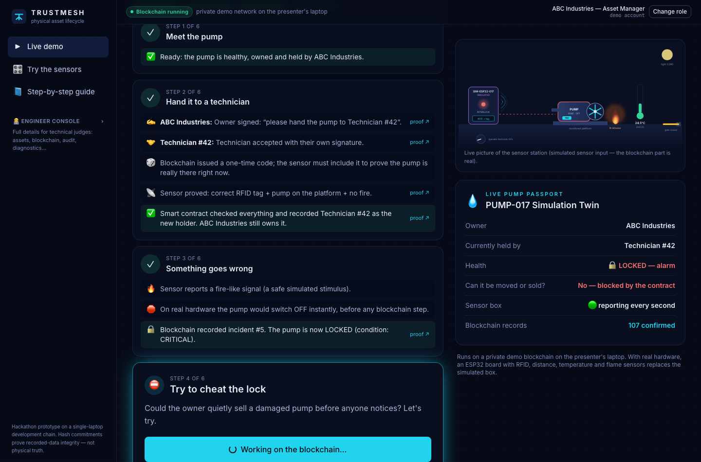
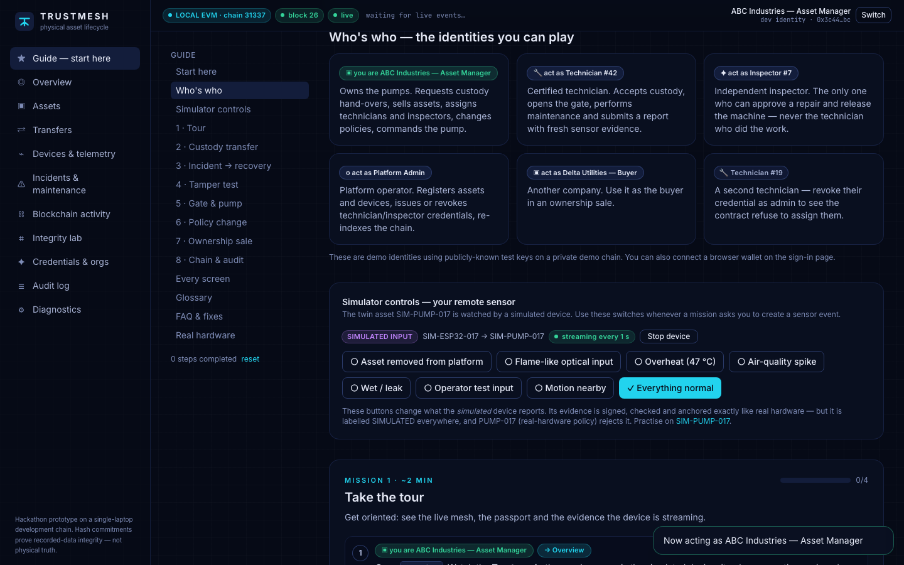
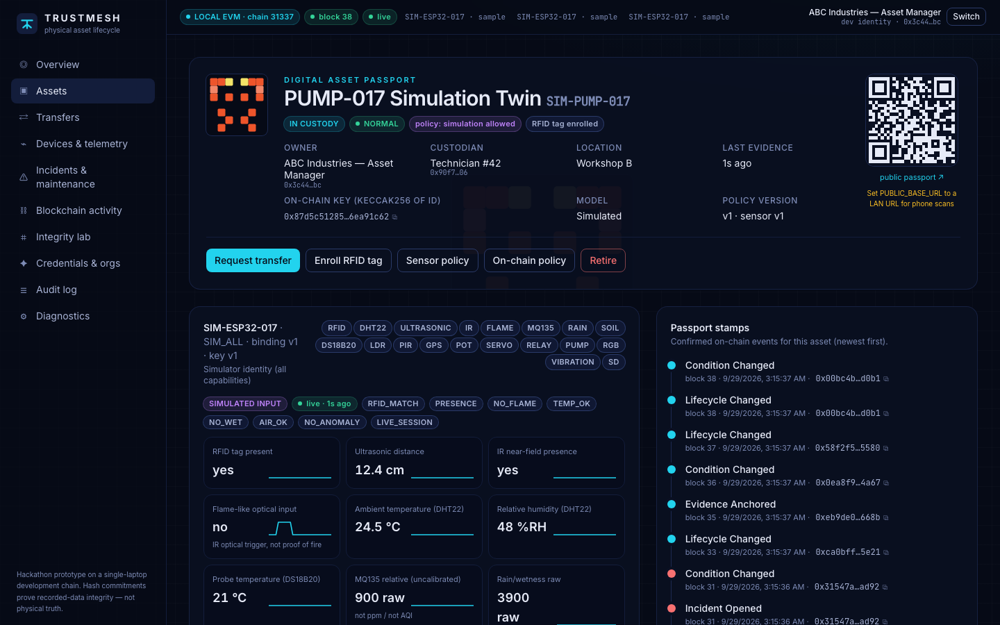
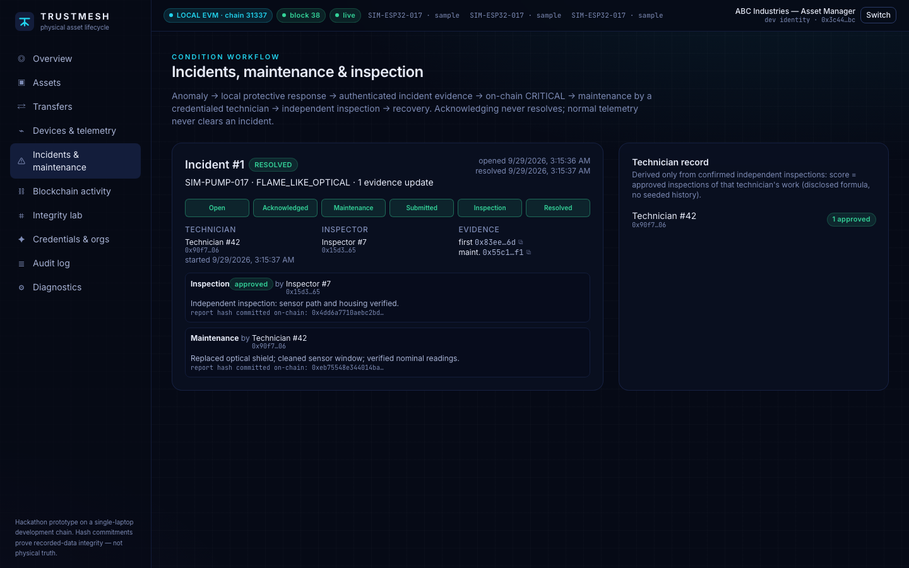
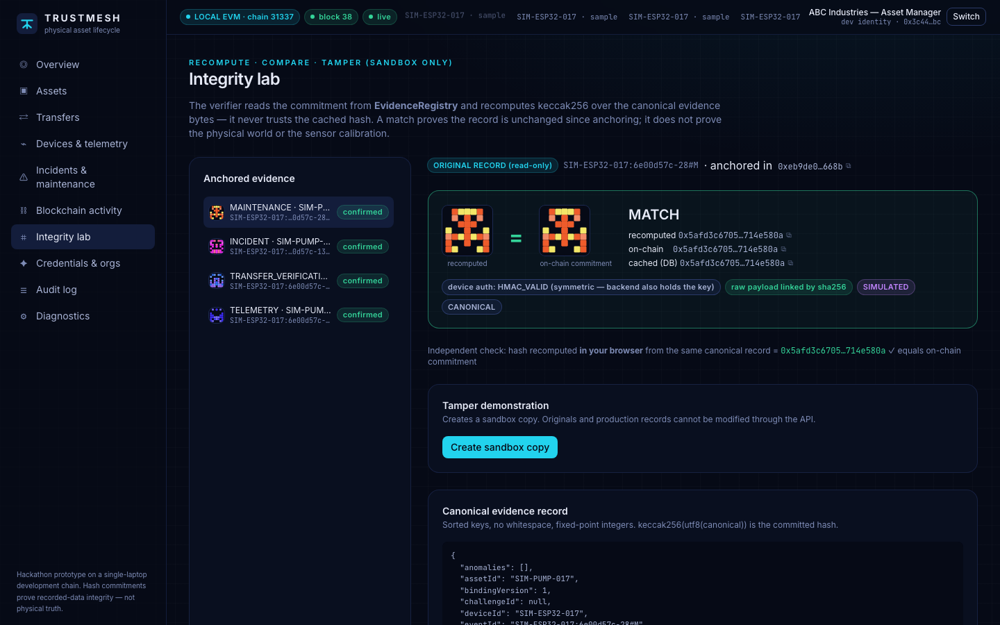
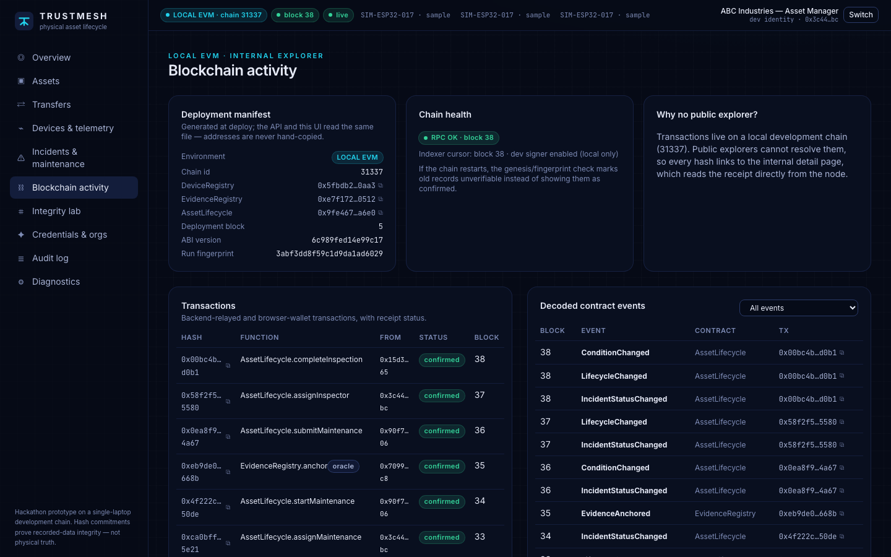
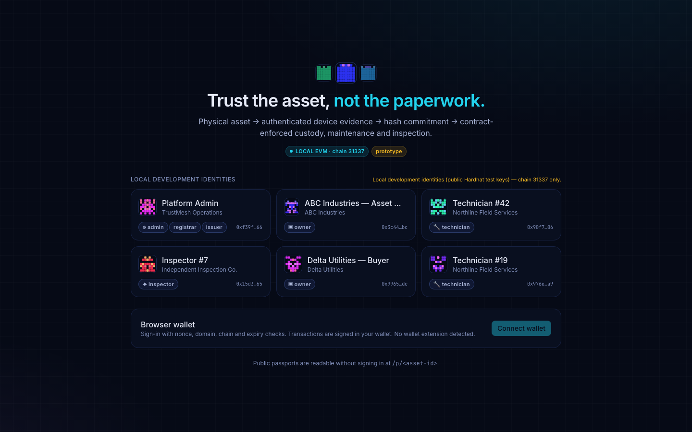

<div align="center">

# TRUSTMESH

### Blockchain-verified physical asset lifecycle

**Trust the asset, not the paperwork.**

A sensor device watches a physical machine and signs what it sees. The evidence is hashed onto a blockchain, and smart contracts decide who may hold, sell, repair or release the machine.




</div>

---

## Why

Physical assets such as pumps, generators and compressors change hands, break and get repaired. Today the records are paperwork anyone can edit, and nothing checks that the machine was actually present when someone signed.

TRUSTMESH connects the physical machine to rules that cannot be bypassed:

```
Physical asset → identified device → authenticated evidence → integrity hash
      → blockchain confirmation → contract-controlled decision → visible response
```

- **Custody handovers** complete only when the device proves, with a one-time challenge, that the tagged asset is really there.
- **Sensor alarms** (flame-like input, removal, overheating, …) lock the asset on-chain. Normal readings or an "acknowledge" click cannot unlock it.
- **Repairs** need a credentialed technician plus a *different*, independent inspector before the asset is released.
- **Tampering** with any stored reading is detected against the on-chain hash.

## Features

| | |
|---|---|
| ⛓ **3 smart contracts** | `DeviceRegistry` · `EvidenceRegistry` · `AssetLifecycle`: custody ≠ ownership, recipient-only acceptance, challenge-bound fresh evidence, REAL-vs-SIMULATED policy, incidents, credentials, independent inspection |
| 🔏 **Authenticated devices** | Per-device HMAC-SHA256 over exact payload bytes, session and replay protection, duplicate detection, signed server responses and commands |
| 🧮 **Verifiable evidence** | Canonical JSON with fixed-point readings, hashed with keccak256 and committed on-chain. The integrity lab recomputes the hash in your browser |
| 🖥 **Live dashboard** | Trust-mesh map, 8-stage evidence pipeline, digital passports with QR codes and "stamps", role-aware workflows, built-in explorer for the local chain |
| ▶ **2-minute live demo** | `/demo`: the whole story in 6 one-click steps with plain-English explanations and "proof" links to each transaction |
| 📘 **In-app guide** | `/guide`: 8 hands-on missions, one-click identity switching and browser controls for a simulated device |
| 📡 **ESP32 firmware** | 6 hardware profiles covering 19 component types, pin maps generated from one file with a conflict checker, local safety interlocks that never wait for the blockchain |
| 🔌 **Two transports** | Wi-Fi (HTTP to the laptop's LAN IP) or USB serial bridge, using the same signed envelopes |
| 🛡 **Reliability** | Durable job queue with crash reconciliation, event indexer with a persistent position, chain-reset detection, SSE with polling fallback |

## Quick start

**Requirements:** Node.js 22.13+ or 24 (see `.nvmrc`), npm and Git. Python 3 and PlatformIO are needed only for firmware.

```bash
git clone https://github.com/adityadas2345678-collab/trustmesh.git
cd trustmesh
npm ci
npm run setup      # creates .env, compiles contracts, generates ABIs and pin maps
npm run doctor     # checks Node, ports, chain and the LAN IPs to use for ESP32
npm run dev        # local chain → deploy → seed → API → web
```

Open **http://localhost:3000** — it lands on the **▶ Live demo**: 6 big buttons that tell the whole story (hand-over → fire alarm → blocked sale → repair & independent inspection → tamper test), each a real blockchain transaction. No roles or setup needed.

| Service | URL |
|---|---|
| Web app | http://localhost:3000 |
| Guide | http://localhost:3000/guide |
| API + OpenAPI docs | http://localhost:4000/docs |
| Local EVM (Hardhat, chain 31337) | http://127.0.0.1:8545 (loopback only) |

You don't need a wallet, faucet, cloud account or internet connection once the dependencies are installed. You sign in with built-in demo identities: an asset owner, Technician #42, Inspector #7, a platform admin and a buyer.

### Scripted rehearsal (no hardware)

```bash
npm run demo:simulate -- --scenario full
```

This runs a simulated device through the **real** device protocol, backend checks and smart contracts:

1. Custody transfer
2. Incident, with the transfer blocked
3. Maintenance
4. Self-inspection rejected
5. Independent approval and recovery
6. Tamper test

## Screenshots

| Guide | Asset passport |
|---|---|
|  |  |
| **Incidents & inspection** | **Integrity lab** |
|  |  |
| **Blockchain activity** | **Sign-in** |
|  |  |

## Commands

| Command | What it does |
|---|---|
| `npm run dev` | Starts everything in order and stops it all on Ctrl+C |
| `npm run demo:simulate [-- --scenario live\|custody\|incident\|integrity\|full]` | Simulated device, labelled SIMULATED everywhere |
| `npm run bridge -- --port <port>` · `-- --list` | USB serial bridge for a real ESP32 |
| `npm run test:all` | Pin checks, shared protocol tests, contracts, API, end-to-end browser tests, firmware host tests |
| `npm run firmware:build` | Compiles all 6 ESP32 profiles |
| `npm run build` | Production builds (contracts, API bundle, web bundle) |
| `npm run reset:demo -- --confirm` | Archives the database, redeploys and reseeds |

## Architecture

```
 ESP32 firmware ──Wi-Fi / USB bridge──▶  API (Fastify + SQLite)  ──oracle txs──▶  Local EVM
 (sense, interlock, sign)                 verify HMAC · policy ·                   DeviceRegistry
                                          canonical evidence · outbox              EvidenceRegistry
 Browser (React) ◀──── SSE / REST ──────  indexer ◀──────── contract events ───── AssetLifecycle
   demo identities → backend dev signer · wallets → sign transactions directly
```

```
apps/api             Fastify API, device protocol, policy engine, outbox, indexer, integrity lab
apps/web             React 19 + Vite + Tailwind 4 UI (includes /guide)
packages/contracts   Solidity contracts, Hardhat tests, deploy script → data/deployment.json
packages/shared      Protocol, canonical hashing, flags/capabilities, action map, ABIs, test vectors
firmware/            PlatformIO ESP32 firmware, pins/profiles.json (single source of truth)
tools/serial-bridge  USB serial ↔ API bridge
scripts/             setup, doctor, dev orchestrator, reset, simulator
tests/               end-to-end suite (isolated chain + API + Chromium), serial PTY test
docs/                full documentation
```

## Hardware

The reference board is an **ESP32-DevKitC (WROOM-32)**.

| Profile | Components |
|---|---|
| **CORE** | RC522 RFID, HC-SR04, IR, DHT22, flame sensor, servo gate, RGB LED |
| **ENV** | DHT22, MQ135, LDR, PIR, flame sensor, potentiometer, RGB LED |
| **WET** | Rain sensor, soil-moisture sensor, DS18B20, HC-SR04, IR, RGB LED |
| **ACT** | Relay → R385 pump, servo, vibration motor, NEO-6M GPS, microSD, potentiometer, RGB LED |
| **FULL_A + FULL_B** | Every component at once, split across two ESP32 boards |

```bash
cd firmware
cp include/secrets.example.h include/secrets.h   # device ID, secret, Wi-Fi, laptop LAN URL
pio run -e core -t upload --upload-port <port>
npm run bridge -- --port <port>                   # or use Wi-Fi with API_HOST=0.0.0.0
```

**Have the Newrro ESP32-S3 kit?** Follow the illustrated [hardware setup guide (PDF)](docs/TRUSTMESH_Hardware_Setup_Guide.pdf), then use `npm run firmware:secrets` and `pio run -e newrro_full -t upload`.

Wiring, power and safety details: [docs/WIRING.md](docs/WIRING.md) · [Coverage of all 19 components](docs/HARDWARE_COVERAGE.md) · [Bill of materials](docs/HARDWARE_BOM.md)

> ⚠️ Use motors only with external supplies and low-voltage loads. No mains wiring. Use safe stimuli only, such as an IR remote for the flame sensor, never real fire.

## Testing

| Suite | Result |
|---|---|
| Smart contracts (Hardhat) | ✅ 24/24 |
| Shared protocol and hash vectors | ✅ 4/4 |
| API (policy engine, outbox crash recovery) | ✅ 10/10 |
| End-to-end: isolated chain + API + UI in Chromium | ✅ 24/24 |
| Firmware host protocol tests, sharing test vectors with the backend | ✅ 3/3 |
| Firmware compile, all 6 profiles | ✅ 6/6 |
| Serial bridge over a pseudo-terminal | ✅ 5/5 |

Details, environment and limitations: [TEST_REPORT.md](TEST_REPORT.md)

## Honest limitations

- **Prototype on a single-laptop development chain.** This is not a decentralized production network. The local chain resets when restarted, and old data is archived.
- **Hardware not yet physically tested.** The firmware compiles for every profile and the protocol is tested, but no real ESP32 or sensors have been wired up yet.
- **One trusted backend "oracle" interprets sensor readings.** Device authentication is symmetric (HMAC): the backend holds the key and could forge a message. This is not public-key device attestation.
- **A hash match proves the record is unchanged, not that the physical world matched it.** RFID UIDs can be cloned. MQ135, LDR and soil readings are relative and uncalibrated.
- **Commands are acknowledged, not physically verified.** There is no flow sensor or gate-position sensor.
- **Demo identities use the public Hardhat test keys.** They only work on chain 31337, only from the host machine, and never in production mode.

## Documentation

| Topic | |
|---|---|
| How it fits together | [Architecture](docs/ARCHITECTURE.md) · [Smart contracts](docs/SMART_CONTRACTS.md) · [IoT protocol](docs/IOT_INTEGRATION.md) |
| Running it | [Local setup (macOS/Windows/Linux)](docs/LOCAL_SETUP.md) · [Troubleshooting](docs/TROUBLESHOOTING.md) · [Deployment](docs/DEPLOYMENT.md) |
| Reference | [API](docs/API.md) · [Database](docs/DATABASE.md) · [Security](docs/SECURITY.md) |
| Demo & judging | [Judge demo script](docs/DEMO.md) · [Evaluation mapping](docs/EVALUATION.md) · [Acceptance matrix](ACCEPTANCE.md) |
| Hardware | [Wiring](docs/WIRING.md) · [Generated wiring tables](docs/WIRING_TABLES.md) · [Coverage](docs/HARDWARE_COVERAGE.md) · [BOM](docs/HARDWARE_BOM.md) |

## Tech stack

Solidity 0.8.28 · OpenZeppelin 5 · Hardhat 2 · viem · Fastify 5 · SQLite (`node:sqlite`) · React 19 · Vite 7 · Tailwind CSS 4 · Playwright · PlatformIO / Arduino-ESP32 · TypeScript throughout

## License

No license has been chosen yet. Add a `LICENSE` file before accepting outside contributions. Third-party dependencies keep their own licenses.
